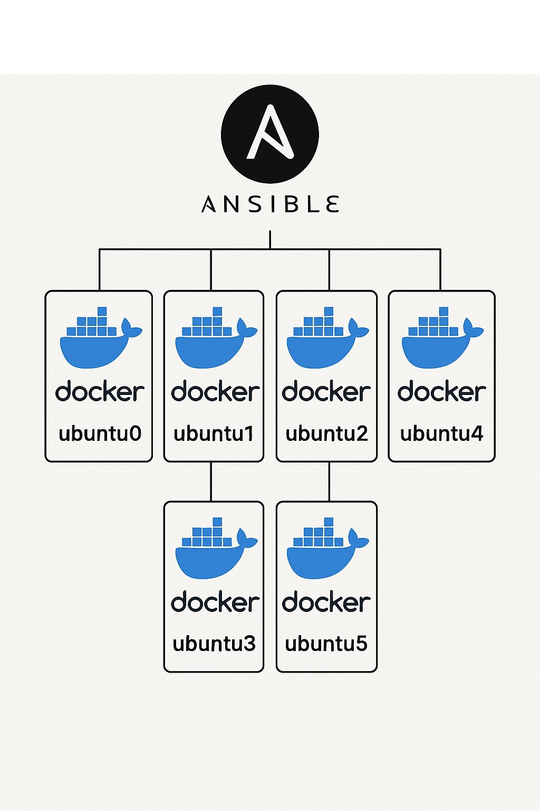

# Ansibledox: Docker-Based Ansible Learning Environment



## 📋 Table of Contents

- [Overview](#overview)
- [Architecture](#architecture)
- [Prerequisites](#prerequisites)
- [Quick Start](#quick-start)
- [Infrastructure Configuration](#infrastructure-configuration)
- [Playbook Examples](#playbook-examples)
- [Troubleshooting](#troubleshooting)
- [Best Practices](#best-practices)
- [Configuration Reference](#configuration-reference)
- [Advanced Usage](#advanced-usage)

## Overview

Ansibledox is a comprehensive learning environment designed to demonstrate the power and flexibility of Ansible automation in a containerized infrastructure. This project provides a practical, hands-on approach to understanding how Ansible can be used to deploy services, manage configurations, and orchestrate complex operations across multiple hosts in a safe, isolated environment.

The project leverages Docker containers to simulate a multi-host infrastructure, allowing users to experiment with Ansible playbooks, inventory management, and automation strategies without the risk of affecting production systems.

### Key Features

- **6 Ubuntu containers** simulating remote hosts
- **SSH-based connectivity** on ports 2222-2228
- **Logical host grouping** for targeted deployments
- **Ansible Vault integration** for secure credential management
- **Ready-to-use playbooks** demonstrating common automation tasks
- **Comprehensive documentation** with step-by-step instructions

## Architecture

### Infrastructure Design

The Ansibledox environment consists of six Docker containers running Ubuntu, each configured to accept SSH connections on different ports. This design allows the entire environment to run on a single machine while simulating the complexity of managing multiple remote hosts.

```
┌─────────────────────────────────────────────────────────────┐
│                    Ansible Control Node                     │
│                      (Your Machine)                         │
└─────────────────────┬───────────────────────────────────────┘
                      │
              SSH Connections
                      │
┌─────────────────────┼───────────────────────────────────────┐
│                     │           Docker Host                 │
│  ┌─────────────┐   │   ┌─────────────┐   ┌─────────────┐   │
│  │   ubuntu0   │◄──┼──►│   ubuntu1   │   │   ubuntu2   │   │
│  │  Port 2222  │   │   │  Port 2223  │   │  Port 2224  │   │
│  └─────────────┘   │   └─────────────┘   └─────────────┘   │
│                     │                                       │
│  ┌─────────────┐   │   ┌─────────────┐   ┌─────────────┐   │
│  │   ubuntu3   │   │   │   ubuntu4   │   │   ubuntu6   │   │
│  │  Port 2225  │   │   │  Port 2226  │   │  Port 2228  │   │
│  └─────────────┘   │   └─────────────┘   └─────────────┘   │
└─────────────────────┼───────────────────────────────────────┘
```

### Host Organization

The infrastructure is organized using a logical grouping strategy:

- **pair_1**: ubuntu0, ubuntu1 (Development environment)
- **pair_2**: ubuntu2, ubuntu3 (Staging environment)  
- **pair_3**: ubuntu4, ubuntu6 (Production environment)
- **ubuntu_pairs**: Parent group containing all pairs

## Prerequisites

### System Requirements

- **Docker**: Version 19.03 or later
- **Ansible**: Version 2.9 or later
- **Python**: Version 3.6 or later
- **Memory**: Minimum 4GB RAM (8GB recommended)
- **Storage**: At least 2GB free space

### Installation Commands

#### Ubuntu/Debian
```bash
# Install Docker
sudo apt update
sudo apt install docker.io docker-compose
sudo usermod -aG docker $USER

# Install Ansible
sudo apt install ansible

# Verify installations
docker --version
ansible --version
```

#### CentOS/RHEL
```bash
# Install Docker
sudo yum install docker docker-compose
sudo systemctl start docker
sudo systemctl enable docker
sudo usermod -aG docker $USER

# Install Ansible
sudo yum install epel-release
sudo yum install ansible

# Verify installations
docker --version
ansible --version
```

#### macOS
```bash
# Install Docker Desktop from https://docker.com
# Install Ansible via Homebrew
brew install ansible

# Verify installations
docker --version
ansible --version
```

## Quick Start

### 1. Clone the Repository

```bash
git clone https://github.com/soyroberto/ansibledox.git
cd ansibledox
```

### 2. Build Docker Infrastructure

Create a Dockerfile for the Ubuntu containers:

```dockerfile
FROM ubuntu:20.04

# Install SSH server and basic tools
RUN apt-get update && \
    DEBIAN_FRONTEND=noninteractive apt-get install -y \
    openssh-server \
    sudo \
    curl \
    wget \
    vim \
    git \
    python3 \
    python3-pip && \
    apt-get clean

# Configure SSH
RUN mkdir /var/run/sshd
RUN echo 'root:ansible' | chpasswd
RUN sed -i 's/#PermitRootLogin prohibit-password/PermitRootLogin yes/' /etc/ssh/sshd_config
RUN sed -i 's/#PasswordAuthentication yes/PasswordAuthentication yes/' /etc/ssh/sshd_config

# SSH login fix
RUN sed 's@session\s*required\s*pam_loginuid.so@session optional pam_loginuid.so@g' -i /etc/pam.d/sshd

EXPOSE 22
CMD ["/usr/sbin/sshd", "-D"]
```

Build the image:

```bash
docker build -t ansibledox-ubuntu .
```

### 3. Launch Containers

Create and start all containers:

```bash
# Create containers with port mappings
docker run -d --name ubuntu0 -p 2222:22 ansibledox-ubuntu
docker run -d --name ubuntu1 -p 2223:22 ansibledox-ubuntu
docker run -d --name ubuntu2 -p 2224:22 ansibledox-ubuntu
docker run -d --name ubuntu3 -p 2225:22 ansibledox-ubuntu
docker run -d --name ubuntu4 -p 2226:22 ansibledox-ubuntu
docker run -d --name ubuntu6 -p 2228:22 ansibledox-ubuntu

# Verify containers are running
docker ps
```

### 4. Set Up Ansible Vault

Create the vault file for secure credential storage:

```bash
# Create vault directory
mkdir -p vault

# Create encrypted secrets file
ansible-vault create vault/secrets.yml
```

Add the following content to the vault file:

```yaml
ansible_ssh_pass: ansible
ansible_become_pass: ansible
```

### 5. Test Connectivity

Verify that Ansible can connect to all hosts:

```bash
# Test connection to all hosts
ansible all -i inventory/hosts.ini -m ping --ask-vault-pass

# Expected output:
# ubuntu0 | SUCCESS => {
#     "ansible_facts": {
#         "discovered_interpreter_python": "/usr/bin/python3"
#     },
#     "changed": false,
#     "ping": "pong"
# }
```

### 6. Run Your First Playbook

Execute the cowsay installation playbook:

```bash
ansible-playbook -i inventory/hosts.ini cowsay.yml --ask-vault-pass
```

## Infrastructure Configuration

### Inventory Structure

The `inventory/hosts.ini` file defines all hosts and their groupings:

```ini
# Static inventory file
[ubuntu_containers]
ubuntu0 ansible_host=localhost ansible_port=2222 ansible_user=root ansible_password={{ ansible_ssh_pass }}
ubuntu1 ansible_host=localhost ansible_port=2223 ansible_user=root ansible_password={{ ansible_ssh_pass }}
ubuntu2 ansible_host=localhost ansible_port=2224 ansible_user=root ansible_password={{ ansible_ssh_pass }}
ubuntu3 ansible_host=localhost ansible_port=2225 ansible_user=root ansible_password={{ ansible_ssh_pass }}
ubuntu4 ansible_host=localhost ansible_port=2226 ansible_user=root ansible_password={{ ansible_ssh_pass }}
ubuntu6 ansible_host=localhost ansible_port=2228 ansible_user=root ansible_password={{ ansible_ssh_pass }}

# Dynamic grouping into pairs
[pair_1]
ubuntu0
ubuntu1

[pair_2]
ubuntu2
ubuntu3

[pair_3]
ubuntu4
ubuntu6

[ubuntu_pairs:children]
pair_1
pair_2
pair_3
```

### Ansible Configuration

Create an `ansible.cfg` file in the project root:

```ini
[defaults]
inventory = inventory/hosts.ini
host_key_checking = False
timeout = 30
gathering = smart
fact_caching = memory

[ssh_connection]
ssh_args = -o ControlMaster=auto -o ControlPersist=60s
pipelining = True
```

## Playbook Examples

### Example 1: Package Installation (cowsay.yml)

This playbook demonstrates basic package installation on the pair_1 group:

```yaml
---
- name: Install cowsay on pair_1 containers
  hosts: pair_1
  become: yes
  vars_files:
    - vault/secrets.yml

  tasks:
    - name: Update apt cache
      apt:
        update_cache: yes
        cache_valid_time: 3600

    - name: Install cowsay package
      apt:
        name: cowsay
        state: present

    - name: Verify cowsay installation
      command: cowsay "Hello from {{ inventory_hostname }}"
      register: cowsay_output

    - name: Display cowsay output
      debug:
        var: cowsay_output.stdout_lines
```

**Execution:**
```bash
ansible-playbook -i inventory/hosts.ini cowsay.yml --ask-vault-pass
```

### Example 2: Shell Configuration (installzsh.yml)

This playbook installs and configures zsh on the pair_2 group:

```yaml
---
- name: Install zsh on pair_2 containers
  hosts: pair_2
  become: yes
  vars_files:
    - vault/secrets.yml

  tasks:
    - name: Update apt cache
      apt:
        update_cache: yes
        cache_valid_time: 3600

    - name: Install zsh and git packages
      apt:
        name:
          - zsh
          - git
          - curl
        state: present

    - name: Set zsh as default shell for root
      user:
        name: root
        shell: /bin/zsh

    - name: Install Oh My Zsh
      shell: |
        sh -c "$(curl -fsSL https://raw.github.com/ohmyzsh/ohmyzsh/master/tools/install.sh)" "" --unattended
      args:
        creates: /root/.oh-my-zsh

    - name: Verify zsh installation
      command: zsh --version
      register: zsh_version

    - name: Display zsh version
      debug:
        var: zsh_version.stdout
```

**Execution:**
```bash
ansible-playbook -i inventory/hosts.ini installzsh.yml --ask-vault-pass
```

### Example 3: Multi-Group Deployment (testools.yml)

This playbook installs testing tools across all host groups:

```yaml
---
- name: Install testing tools on all containers
  hosts: ubuntu_pairs
  become: yes
  vars_files:
    - vault/secrets.yml

  tasks:
    - name: Update package cache
      apt:
        update_cache: yes
        cache_valid_time: 3600

    - name: Install network testing tools
      apt:
        name:
          - netcat
          - telnet
          - nmap
          - tcpdump
          - htop
          - tree
        state: present

    - name: Install Python packages for testing
      pip:
        name:
          - requests
          - pytest
          - paramiko
        state: present

    - name: Create test directory
      file:
        path: /opt/tests
        state: directory
        mode: '0755'

    - name: Create simple connectivity test script
      copy:
        content: |
          #!/bin/bash
          echo "Testing connectivity from {{ inventory_hostname }}"
          echo "Hostname: $(hostname)"
          echo "IP Address: $(hostname -I)"
          echo "Uptime: $(uptime)"
        dest: /opt/tests/connectivity_test.sh
        mode: '0755'

    - name: Run connectivity test
      command: /opt/tests/connectivity_test.sh
      register: test_output

    - name: Display test results
      debug:
        var: test_output.stdout_lines
```

**Execution:**
```bash
ansible-playbook -i inventory/hosts.ini testools.yml --ask-vault-pass
```

## Troubleshooting

### Common Connection Issues

#### SSH Connection Refused
```bash
# Check if containers are running
docker ps

# Check if SSH service is running in container
docker exec ubuntu0 service ssh status

# Restart SSH service if needed
docker exec ubuntu0 service ssh restart
```

#### Authentication Failures
```bash
# Test SSH connection manually
ssh -p 2222 root@localhost

# Verify vault decryption
ansible-vault view vault/secrets.yml

# Test with verbose output
ansible all -i inventory/hosts.ini -m ping --ask-vault-pass -vvv
```

#### Port Conflicts
```bash
# Check for port conflicts
netstat -tulpn | grep :2222

# Stop conflicting services
sudo systemctl stop service_name

# Use different ports if needed
docker run -d --name ubuntu0 -p 2232:22 ansibledox-ubuntu
```

### Container Management

#### View Container Logs
```bash
# Check container logs
docker logs ubuntu0

# Follow logs in real-time
docker logs -f ubuntu0
```

#### Restart Containers
```bash
# Restart specific container
docker restart ubuntu0

# Restart all containers
docker restart ubuntu0 ubuntu1 ubuntu2 ubuntu3 ubuntu4 ubuntu6
```

#### Clean Up Environment
```bash
# Stop all containers
docker stop ubuntu0 ubuntu1 ubuntu2 ubuntu3 ubuntu4 ubuntu6

# Remove containers
docker rm ubuntu0 ubuntu1 ubuntu2 ubuntu3 ubuntu4 ubuntu6

# Remove image
docker rmi ansibledox-ubuntu
```

### Playbook Debugging

#### Syntax Validation
```bash
# Check playbook syntax
ansible-playbook --syntax-check cowsay.yml

# Dry run (check mode)
ansible-playbook -i inventory/hosts.ini cowsay.yml --check --ask-vault-pass
```

#### Verbose Output
```bash
# Run with verbose output
ansible-playbook -i inventory/hosts.ini cowsay.yml --ask-vault-pass -v

# Maximum verbosity
ansible-playbook -i inventory/hosts.ini cowsay.yml --ask-vault-pass -vvvv
```

## Best Practices

### Security Considerations

#### Vault Management
```bash
# Change vault password
ansible-vault rekey vault/secrets.yml

# Edit vault file
ansible-vault edit vault/secrets.yml

# Use vault password file (for automation)
echo "your_vault_password" > .vault_pass
chmod 600 .vault_pass
ansible-playbook -i inventory/hosts.ini cowsay.yml --vault-password-file .vault_pass
```

#### SSH Key Authentication
```bash
# Generate SSH key pair
ssh-keygen -t rsa -b 4096 -f ~/.ssh/ansibledox_key

# Copy public key to containers
for port in {2222..2228}; do
  ssh-copy-id -i ~/.ssh/ansibledox_key.pub -p $port root@localhost
done

# Update inventory to use key authentication
# ansible_ssh_private_key_file=~/.ssh/ansibledox_key
```

### Performance Optimization

#### Parallel Execution
```yaml
---
- name: Optimized playbook with parallel execution
  hosts: ubuntu_pairs
  strategy: free  # Allow hosts to run independently
  serial: 3       # Process 3 hosts at a time
  become: yes
```

#### Fact Caching
```ini
# In ansible.cfg
[defaults]
gathering = smart
fact_caching = jsonfile
fact_caching_connection = /tmp/ansible_facts_cache
fact_caching_timeout = 86400
```

### Code Organization

#### Directory Structure
```
ansibledox/
├── ansible.cfg
├── inventory/
│   ├── hosts.ini
│   └── group_vars/
│       ├── all.yml
│       ├── pair_1.yml
│       ├── pair_2.yml
│       └── pair_3.yml
├── vault/
│   └── secrets.yml
├── playbooks/
│   ├── cowsay.yml
│   ├── installzsh.yml
│   └── testools.yml
├── roles/
│   ├── common/
│   ├── webserver/
│   └── database/
└── files/
    └── templates/
```

## Configuration Reference

### Host Configuration Table

| Host | Group | SSH Port | Purpose | Resources |
|------|-------|----------|---------|-----------|
| ubuntu0 | pair_1 | 2222 | Development host 1 | 512MB RAM |
| ubuntu1 | pair_1 | 2223 | Development host 2 | 512MB RAM |
| ubuntu2 | pair_2 | 2224 | Staging host 1 | 512MB RAM |
| ubuntu3 | pair_2 | 2225 | Staging host 2 | 512MB RAM |
| ubuntu4 | pair_3 | 2226 | Production host 1 | 512MB RAM |
| ubuntu6 | pair_3 | 2228 | Production host 2 | 512MB RAM |

### Playbook Reference

| Playbook | Target | Purpose | Modules Used |
|----------|--------|---------|--------------|
| `cowsay.yml` | pair_1 | Package installation demo | apt, command, debug |
| `installzsh.yml` | pair_2 | Shell configuration | apt, user, shell, pip |
| `lolcat.yml` | pair_3 | Utility installation | apt, gem, command |
| `testools.yml` | ubuntu_pairs | Testing utilities | apt, pip, file, copy |
| `testssh.yml` | ubuntu_pairs | SSH validation | command, debug, wait_for |

### Ansible Modules Reference

| Module | Purpose | Example Usage |
|--------|---------|---------------|
| `apt` | Package management | `apt: name=nginx state=present` |
| `copy` | File copying | `copy: src=file.txt dest=/tmp/` |
| `template` | Template processing | `template: src=config.j2 dest=/etc/config` |
| `service` | Service management | `service: name=nginx state=started` |
| `user` | User management | `user: name=deploy shell=/bin/bash` |
| `file` | File/directory operations | `file: path=/opt/app state=directory` |
| `command` | Execute commands | `command: /usr/bin/some-command` |
| `shell` | Execute shell commands | `shell: echo $HOME` |

## Advanced Usage

### Multi-Environment Deployment

Create environment-specific variable files:

```yaml
# group_vars/pair_1.yml (Development)
environment: development
debug_mode: true
log_level: debug

# group_vars/pair_2.yml (Staging)
environment: staging
debug_mode: false
log_level: info

# group_vars/pair_3.yml (Production)
environment: production
debug_mode: false
log_level: error
```

### Custom Roles

Create reusable roles for common tasks:

```bash
# Create role structure
mkdir -p roles/webserver/{tasks,handlers,templates,files,vars,defaults}

# roles/webserver/tasks/main.yml
---
- name: Install nginx
  apt:
    name: nginx
    state: present

- name: Configure nginx
  template:
    src: nginx.conf.j2
    dest: /etc/nginx/nginx.conf
  notify: restart nginx

- name: Start nginx service
  service:
    name: nginx
    state: started
    enabled: yes
```

### CI/CD Integration

Example GitHub Actions workflow:

```yaml
# .github/workflows/ansible-test.yml
name: Ansible Testing
on: [push, pull_request]

jobs:
  test:
    runs-on: ubuntu-latest
    steps:
      - uses: actions/checkout@v2
      
      - name: Set up Python
        uses: actions/setup-python@v2
        with:
          python-version: 3.8
          
      - name: Install Ansible
        run: pip install ansible
        
      - name: Syntax check
        run: ansible-playbook --syntax-check *.yml
        
      - name: Lint playbooks
        run: ansible-lint *.yml
```

---

## Contributing

1. Fork the repository
2. Create a feature branch (`git checkout -b feature/amazing-feature`)
3. Commit your changes (`git commit -m 'Add amazing feature'`)
4. Push to the branch (`git push origin feature/amazing-feature`)
5. Open a Pull Request

## License

This project is licensed under the MIT License - see the [LICENSE](LICENSE) file for details.

## Support

- 📖 [Ansible Documentation](https://docs.ansible.com/)
- 🐳 [Docker Documentation](https://docs.docker.com/)
- 💬 [Community Support](https://github.com/soyroberto/ansibledox/discussions)
- 🐛 [Report Issues](https://github.com/soyroberto/ansibledox/issues)

---

*Created with ❤️ for the Ansible learning community*

Roberto / roberto@rober.to
